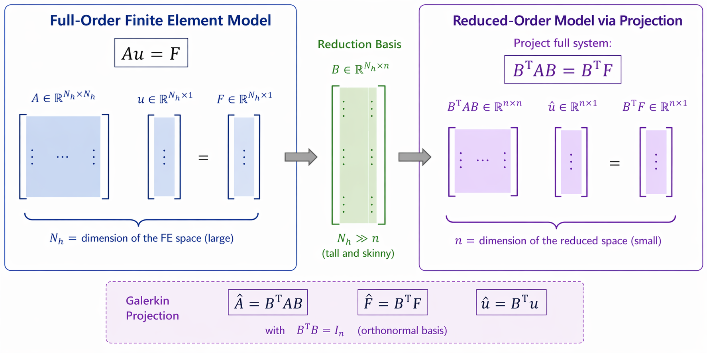
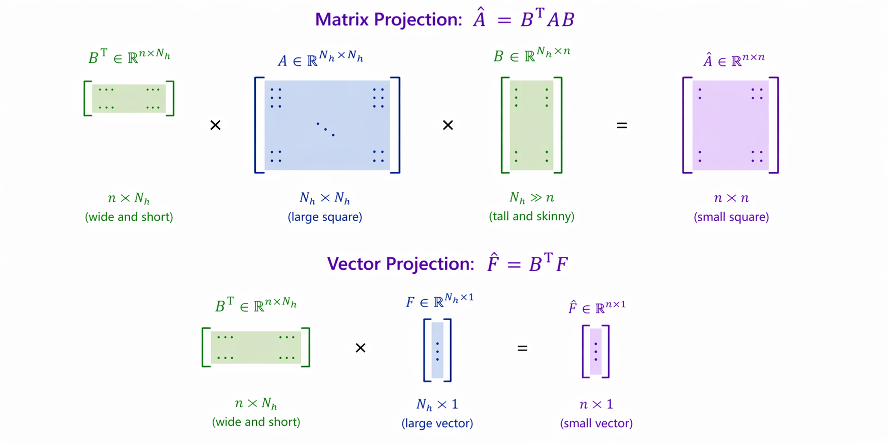
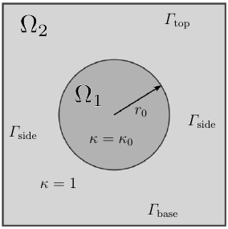
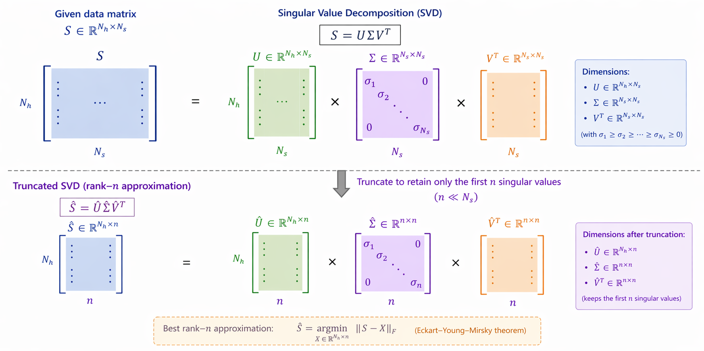

<!--
title: Lecture 023 Model Order Reduction
paginate: true
_class: titlepage
-->

# Model Order Reduction

---

# Parametric PDE

Consider the FEM discretization of a PDE linear problem on $\Omega_h$: find $u_h \in V_h$ such that
$$
a(u_h,v_h) = F(v_h) \qquad \forall v_h \in V_h,  \qquad + BC
$$
and suppose that there are some parameters $\mu \in \mathbb{P} \subset \mathbb R^{P}$ that modify the problem:
* $\Omega_h(\mu)$
* $a(u_h,v_h;\mu)$
* $F(v_b;\mu)$
* BC$(\mu)$

We would like to
* know the solution for many $\mu_i$ (e.g. we want to compute statistics, we need to do optimization)
* we need a fast evaluation $\mu \mapsto u_h(\mu)$.

But it is **too expensive** to compute all FEM simulations

---

# Model order reduction (MOR) 
(or reduced order model (ROM))

We look for a smaller space $V_n = \langle \lbrace \psi_i \rbrace_{i=1}^n \rangle$ with dimension $n\ll N_h$, which is a **good approximation** of the space generated by $\langle \lbrace u_h(\mu) \text{ with }\mu \in \mathbb{P} \rbrace \rangle \subset V_h$, where $\mathbb{P}$ is the parameter space.

1. What does the problem becomes in the space $V_n$?
2. Is solving the problem in $V_n$ faster than in $V_h$?
3. How do I find the space $V_n$?

---

* FEM: $V_h = \langle \lbrace \varphi_i \rbrace_{i=1}^{N_h} \rbrace$ and $u_h(x):= \sum_{j=1}^{N_h} \varphi_j(x) u_j$ with $u_j$ the unknown coefficients.
$$
\sum_j a(\varphi_i, \varphi_j ;\mu) u_j = F(\varphi_i;\mu) \qquad \forall i=1,\ldots,N_h
$$
* ROM Galerkin Projection: $V_n = \langle \lbrace \psi_i \rbrace_{i=1}^n \rbrace$ and $u_n(x):= \sum_{j=1}^{n} \psi_j(x) \hat{u}_j$ with $u_j$ the unknown coefficients.
$$
\sum_j a(\psi_i, \psi_j ;\mu) \hat{u}_j = F(\psi_i;\mu) \qquad \forall i=1,\ldots,n.
$$

#### Matrix formulation
$\psi_i(x) = \sum_{j=1}^{N_h} B_{ji} \varphi_j(x)$. So, we can look at the ROM basis functions as a set of coefficients $B \in \mathbb R^{N_h \times n}$ that define the ROM space $V_n$ as a subspace of $V_h$.

The FEM problem is given by $A(\mu) u = F(\mu)$, where $A_{ij}(\mu) = a(\varphi_i, \varphi_j ;\mu)$ and $F_i(\mu) = F(\varphi_i;\mu)$.

The ROM problem is given by $\hat{A}(\mu) \hat{u} = \hat{F}(\mu)$, where 
$$\hat{A}_{ij}(\mu) = a(\psi_i, \psi_j ;\mu) = \sum_{k,l=1}^{N_h} a( B_{ki} \varphi_k, B_{lj} \varphi_l;\mu)= \sum_{k,l=1}^{N_h} B_{ki}(\mu) A_{kl}(\mu) B_{lj}(\mu) = (B^T A(\mu) B)_{ij}$$ 
and $\hat{F}_i(\mu) = F(\psi_i;\mu) = \sum_{j=1}^{N_h} B_{ji}(\mu) F_j(\mu) = (B^T F(\mu))_i$.

---

---

---

# Affine decomposition of the system

The ROM problem is really cheaper if we can also assemble the ROM matrices ahead of time in a **offline** phase, i.e. if we can write
$$
A(\mu) = \sum_{q=1}^{Q_a} \Theta^a_q(\mu) A_q, \qquad F(\mu) = \sum_{q=1}^{Q_F} \theta^F_q(\mu) F_q,
$$
where $A_q \in \mathbb R^{N_h \times N_h}$ and $F_q \in \mathbb R^{N_h}$ are parameter-independent matrices and vectors and $\Theta^a_q(\mu):\mathbb{P}\to \mathbb R$ and $\theta^F_q(\mu):\mathbb{P}\to \mathbb R$ are parameter-dependent scalar functions.
In this way, we can precompute the ROM matrices and vectors 
$$
\hat{A}_q = B^T A_q B, \qquad \hat{F}_q = B^T F_q
$$ 
and then assemble the ROM system in the **online** phase as
$$
\begin{aligned}
&\hat{A}(\mu) = \sum_{q=1}^{Q_a} \Theta^a_q(\mu) \hat{A}_q = \sum_{q=1}^{Q_a} \Theta^a_q(\mu) B^T A_q B = B^TA(\mu)B, \\
&\hat{F}(\mu) = \sum_{q=1}^{Q_F} \theta^F_q(\mu) \hat{F}_q = \sum_{q=1}^{Q_F} \theta^F_q(\mu) B^T F_q = B^T F(\mu).
\end{aligned}
$$

---

## Example of affine decomposition: the Poisson problem with a parameter-dependent diffusion coefficient
Consider the Poisson problem with a parameter-dependent diffusion coefficient $\kappa(\mu)$:
$$\begin{cases}
-\nabla \cdot (\kappa(x;\mu) \nabla u) = f & \text{in } \Omega, \\
u(x) = 0, \, & x \in \Gamma_{top}, \\
\kappa(x;\mu) \nabla u(x) \cdot \mathbf{n} = 0, \, & x \in \Gamma_{side},\\
\kappa(x;\mu) \nabla u(x) \cdot \mathbf{n}  = \mu_2, \,&  x \in \Gamma_{base}.
\end{cases}$$

Where the diffusion coefficient $\kappa(\mu)$ is given by
$$\kappa(\mu) = \begin{cases}
\mu_1 & \text{in } \Omega_1, \\
1 & \text{in } \Omega_2.
\end{cases}$$

The affine decomposition of $a$ can be written as 
$$
\begin{aligned}
&a(\varphi_i, \varphi_j ;\mu) = \sum_{q=1}^{2} \Theta^a_q(\mu) a_q(\varphi_i, \varphi_j), \\
&a_1(\varphi_i, \varphi_j) = \int_{\Omega_1} \nabla \varphi_i \cdot \nabla \varphi_j dx, \qquad \Theta^a_1(\mu) = \mu_1, \\
&a_2(\varphi_i, \varphi_j) = \int_{\Omega_2} \nabla \varphi_i \cdot \nabla \varphi_j dx, \qquad \Theta^a_2(\mu) = \mu_2,\\
&f_1(\varphi_i) = \int_{\Gamma_{base}} \varphi_i ds, \qquad \theta^F_1(\mu) = \mu_2.
\end{aligned}
$$

---

# How to build the ROM space $V_n$? Proper orthogonal decomposition (POD)

In an **offline** phase, we compute the solution of the full order model (FOM) for a set of parameters $\lbrace \mu_1, \ldots, \mu_{N_s} \rbrace$ and we collect the solutions in a matrix $S = [u_h(\mu_1), \ldots, u_h(\mu_{N_s})] \in \mathbb R^{N_h \times N_s}$, called **snapshot matrix** ($N_s \ll N_h$).

We then apply the **SVD** algorithm to the snapshot matrix $S$ and we select the first $n$ left singular vectors as the ROM basis functions $\lbrace \psi_i \rbrace_{i=1}^n$.

$$
S = U \Sigma V^T, \qquad U = [\psi_1, \ldots, \psi_{N_s}] \in \mathbb R^{N_h \times N_s}, \qquad \Sigma = diag(\sigma_1, \ldots, \sigma_{N_s}) \in \mathbb R^{N_s \times N_s}, \qquad V = [v_1, \ldots, v_{N_s}] \in \mathbb R^{N_s \times N_s},
$$
with $\sigma_1 \geq \sigma_2 \geq \ldots \geq \sigma_{N_s} \geq 0$ the singular values of $S$.

Keep only the first $n$ singular values, which gives the most important information of the snapshot matrix, and discard the rest. 
So, we approximate 
$$
S \approx \hat{S} = \hat{U} \hat{\Sigma} \hat{V}^T, \qquad \hat{U} = [\psi_1, \ldots, \psi_{n}] \in \mathbb R^{N_h \times n}, \qquad \hat{\Sigma} = diag(\sigma_1, \ldots, \sigma_{n}) \in \mathbb R^{n \times n}, \qquad \hat{V} = [v_1, \ldots, v_{n}] \in \mathbb R^{N_s \times n}.
$$
The ROM basis functions are given by $\psi_i = B_{:,i}:= U_{:,i}$ for $i=1,\ldots,n$.

---

---

# Is it the best approximation? Theorem (Eckart-Young-Mirsky)

Given $S = U \Sigma V^T$ the SVD of $S$, the best rank-$n$ approximation of $S$ in the Spectral/Frobenius norm is given by
$$
\hat{S} = \hat{U} \hat{\Sigma} \hat{V}^T, \qquad \hat{U} = [\psi_1, \ldots, \psi_{n}] \in \mathbb R^{N_h \times n}, \qquad \hat{\Sigma} = diag(\sigma_1, \ldots, \sigma_{n}) \in \mathbb R^{n \times n}, \qquad \hat{V} = [v_1, \ldots, v_{n}] \in \mathbb R^{N_s \times n}.
$$
with $\sigma_1 \geq \sigma_2 \geq \ldots \geq \sigma_{N_s} \geq 0$ the singular values of $S$.

This means that for any other matrix $B$ of rank $n$ we have
$$
\|S - \hat{S}\|_2 \leq \|S - B\|_2, \qquad \|S - \hat{S}\|_F \leq \|S - B\|_F.
$$
**Proof:** https://en.wikipedia.org/wiki/Low-rank_approximation

---

# Extension to time dependent problems

$$\left( \partial_t u_h, v_h \right) + a(u_h,v_h;\mu) = F(v_h;\mu) \qquad \forall v_h \in V_h,  \qquad + BC
$$
As before, we can for the reduced coefficients $\hat{u}(t;\mu)$ in the ROM space $V_n$:
$$\sum_j \left( \psi_j, \psi_i \right)\partial_t \hat{u}_j + \sum_j a(\psi_j,\psi_i;\mu)\hat{u}_j = F(\psi_i;\mu) \qquad \forall i=1,\ldots,n,  \qquad + BC
$$
Either for explicit or implicit time integration. Clearly, there is more advantage and reduction in the implicit case.

---

# Linear acoustics problem
In the linear acoustics problem there are several questions open:
* Which parameters should we consider? (Time is one parameter, Initial conditions can be parametrized, the speed of sound can be parametrized)
$$
\begin{cases}
\partial_t p + \rho_0 c^2 \nabla \cdot \mathbf{u} = 0, \\
\partial_t \mathbf{u} + \frac{1}{\rho_0} \nabla p = 0.
\end{cases}
$$
* How do we consider the ROM? Component by component? Or all together? i.e., are we looking for a ROM space such that 
$$(p(x,\mu),u(x,\mu),v(x,\mu)) = \sum_{i=1}^n (\psi^p_i(x),\psi^u_i(x),\psi^v_i(x)) \hat{c}_i$$
 or 
$$p = \sum_{i=1}^{n_p} \psi_i^p\hat{p}_i , \, u = \sum_{i=1}^{n_u} \psi_i^u\hat{u}_i , \, v = \sum_{i=1}^{n_v} \psi_i^v\hat{v}_i?$$
* Will the scheme be stable? In the explicit case? In the implicit? Can we say something on energy stability?